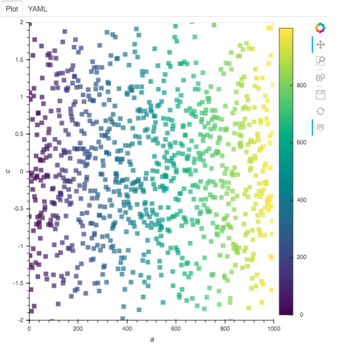

Usage
=====

The ``dfviz`` interface is designed to be simple and easy to use.

Invoking dfviz
--------------

The main entry point is ``dfviz.DFViz``. Pass either a Pandas or Dask dataframe, and optionally
pass values for any of the widget in interface. The following sets the plot type to "bar"
and that the "y" values should be taken from (the only) column "data":

.. code-block::

    import pandas as pd
    import dfviz

    df = pd.DataFrame({'data': [5, 2, 6]})
    dfv = dfviz.DFViz(df, kind="bar", y=["data"])

To show the interface, you can simply render ``dfv.panel`` in a notebook cell (by letting it
be the last thing in the cell), using `display()`_ on ``dfv.panel``, or running ``dfv.show()``,
which will launch the interface stand-alone in a new browser tab.

.. _display(): https://ipython.readthedocs.io/en/stable/api/generated/IPython.display.html#module-IPython.display

Walkthrough
-----------

Ee will demonstrate the options available in the interface by using example random data.
To view the example, please execute

.. code-block:: python

    import dfviz
    dfviz,example.run_example()

and you should see the following in a browser tab

The interface has three main components:

- above the grey area are the two main controls to select the type of plot, and to render the plot

- the central grey area, which dominates the space, is for user input. Here you can define the sampling
  of the data, the columns to use, and style attributes of the plot

- below, and currently blank, is hte output area, which will contain the plot and a text description of
  how to produce this plot from the data.

Clicking Plot
-------------

The "Plot" button causes a rendering of the data with the current selections. If you change
parameters in the input area, the plot will not update until you press this button. Try it now.
The two panes of the output area will contain the graph:

and the parameters that were used to produce it

Note that the example sets the parameters to produce decent output.

Setting Parameters
------------------

Each pane contains different controls which affect the plot you will see:

"Plot Type"
~~~~~~~~~~~

Several types of output are available, provided by `hvPlot`_. Please follow the link
to see the kinds of output you can expect, and the effect that setting parameters can
have on them.

.. _hvPlot: https://hvplot.pyviz.org/user_guide/Plotting.html

"Control"
~~~~~~~~~

These are global parameters, particularly the sampling of the underlying data.

For example, choosing to sample (checking the box next to "Sample") and picking the "Head"
method with 100 rows will select only the first 1/10th of the data and
will produce output something like

"Fields"
~~~~~~~~

Here we can define which column of the input data is used for what function while plotting.
The example data-frame contains columns "a", "b", "c" and "d". So for example, if we select
columns "a" (a monotonically increasing integer) for the ``y`` axis

we get output

Which field functions can be selected here will depend on the plot type; for example, the `table`
plot type only allows selection of which columns to show, but
statistical plots like `violin` allow grouping in this case "by" categorical column "d":

It is possible to pick combinations of fields which do not produce any reasonable
output. Again, please refer to `hvPlot`_.

"Style"
~~~~~~~

This pane offers optional parameters which affect the general look of the plot, such as colours,
marker styles and axes extent. Some of these are also only shown for those plot types where they
are appropriate; and some will not have any effect for all combinations of fields selections
(a legend is not shown when only one column is selected, even if the a legend is requested).
